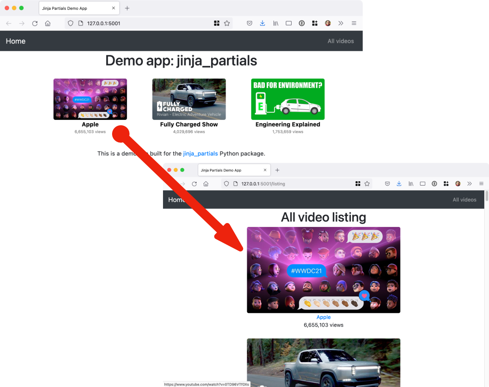

# Jinja Partials

Simple reuse of partial HTML page templates in the Jinja template language for Python web frameworks.

## Overview

When building real-world web apps with Flask + Jinja2, it's easy to end up with repeated HTML fragments.
Just like organizing code for reuse, it would be ideal to reuse smaller sections of HTML template code.
That's what this library is all about.

## Example

This project comes with a sample flask application (see the `example` folder). This app displays videos
that can be played on YouTube. The image, subtitle of author and view count are reused throughout the
app. Here's a visual:



Check out the demo / example application to see it in action. 

## Installation

It's just `pip install jinja-partials` and you're all set with this pure Python package.

## Usage

Using the library is incredible easy. The first step is to register the partial method with Jinja and Flask.
Do this once at app startup:

```python
import flask
import jinja_partials

app = flask.Flask(__name__)

jinja_partials.register_extensions(app)
# ...
```

Next, you define your main HTML (Jinja2) templates as usual. Then 
define your partial templates. I recommend locating and naming them accordingly:

```
├── templates
│   ├── home
│   │   ├── index.html
│   │   └── listing.html
│   └── shared
│       ├── _layout.html
│       └── partials
│           ├── partial_video_image.html
│           └── partial_video_square.html
```

Notice the `partials` subfolder in the `templates` folder.

The templates are just HTML fragments. Here is a stand-alone one for the YouTube thumbnail from
the example app:

```html

```

Notice that an object called `video` and list of classes are passed in as the model.

Templates can also be nested. Here is the whole single video fragment with the image as well as other info
linking out to YouTube:

```html
<div>
    <a href="https://www.youtube.com/watch?v={{ video.id }}" target="_blank">
        {{ render_partial('shared/partials/partial_video_image.html', video=video) }}
    </a>
    <a href="https://www.youtube.com/watch?v={{ video.id }}" target="_blank"
       class="author">{{ video.author }}</a>
    <div class="views">{{ "{:,}".format(video.views) }} views</div>
</div>
```

Now you see the `render_partial()` method. It takes the subpath into the templates folder and
any model data passed in as keyword arguments.

We can finally generate the single video blocks as follows:

```html


    <div class="col-md-3 video">
        {{ render_partial('shared/partials/partial_video_square.html', video=v) }}
    </div>


```

This time, we reframe each item in the list from the outer template (called `v`) as the `video` model
in the outer HTML section.
